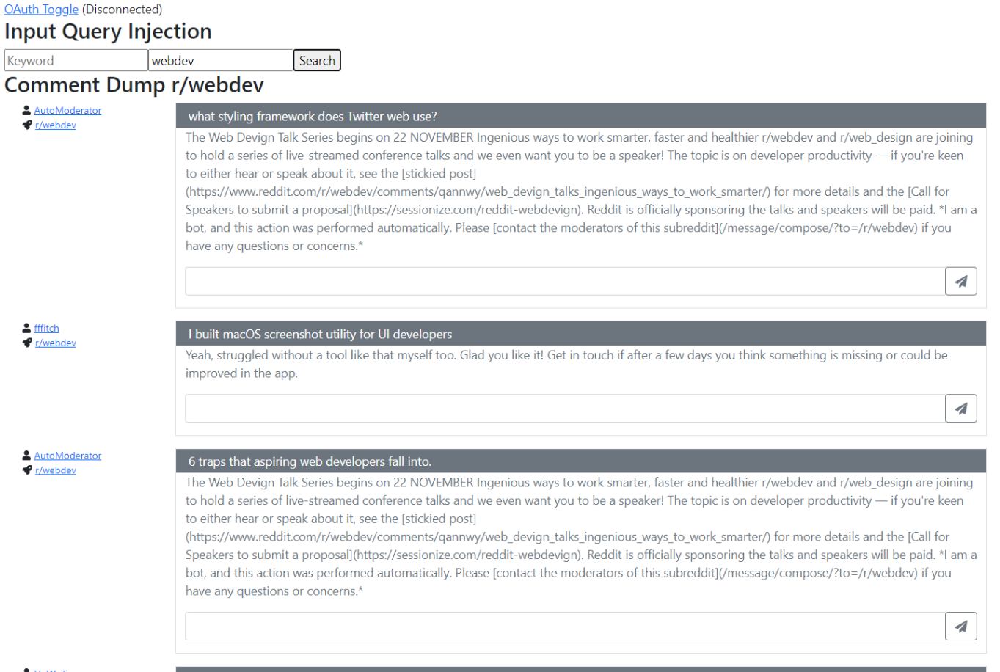

# RStew - Reddit Stew

  

## About

RStew is a single-page Angular application developed with the goal of providing Reddit users with a way to monitor live keyword discussions. For example, you're a company representative were looking to monitor sentiment about a newly released product. By entering the product's name (and an optional subreddit), you can actively monitor any newly posted comments with your selected keyword, allowing you to research, monitor, and reply to any newly posted related comments!

## Development

**This project is currently in the initial stages of development.**

At the moment, users are able to connect through an OAuth session to an existing Reddit account and post replies based on active keywords or subreddit filters. The following should be noted before spinning up the application on your own.

* Keywords are currently non-discriminate; searching for "app" may return the keyword, "**app**liance", and "h**app**en" for example.
* There isn't an active NSFW filter; Reddit supports this feature through their API and it will be implemented soon.
* Live-loading of new comments is currently disabled while other components are being developed, click "search" to update.
* New results are appended to the top of the current feed. If there are no results from your search, the feed won't change.
* Reddit client_id and client_secret need to be provided through your own Reddit application permissions.

## Project Planning

There are several big-picture ideas in mind for RStew; the following are core features that will be available in the initial release.

* Secure OAuth persistence through database storage.
* Keyword watch lists, advanced filtering, and live notifications.
* Multiple keyword monitoring support.
* Enhanced comment management (track/edit app-generated replies).
* Multi-user management (switch between Reddit accounts).

## Contributing

RStew is currently open-source, but not accepting pull requests until core features have been completed. Stay tuned!
